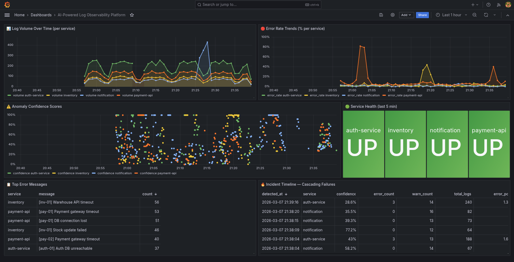

# 🔨 LogForge

**LogForge** is a distributed log aggregation and analytics system built for high-throughput applications.  
It ingests logs via HTTP, buffers them safely using Redis Streams, processes them in batches, stores them efficiently in ClickHouse, and exposes real-time analytics through a web dashboard with **ML-powered anomaly detection**.

This project demonstrates real-world system design concepts such as asynchronous ingestion, batching, fault tolerance, scalable analytics, and intelligent monitoring.

---

## ✨ Features

- 🚀 High-throughput log ingestion via HTTP
- 🧵 Redis Streams–based buffering (backpressure friendly)
- 📦 Batch processing for efficient storage
- 🏎️ ClickHouse for fast analytical queries
- 📊 Real-time dashboard with filtering & charts
- 🔍 Filter logs by service, level, message, and time range
- ⏱️ Automatic log retention using ClickHouse TTL
- 🤖 **ML-based anomaly detection** using Isolation Forest
- 🎯 **Seasonal pattern learning** for hour-based anomaly scoring
- 🔔 **Real-time anomaly alerts** with confidence scoring
- 📈 **Anomaly dashboard** with historical trends
- 🐳 Fully Dockerized setup

---

## 🧠 Architecture Overview

```
Client / Services
|
v
HTTP Collector
|
v
Redis Streams
|
v
Processor
|
v
ClickHouse
|         \
v          v
API    Anomaly Detector
|          |
v          v
Frontend (Logs + Anomalies)
```

### Component Roles

| Component   | Responsibility |
|------------|----------------|
| Collector  | Receives logs over HTTP |
| Redis      | Buffers logs using streams |
| Processor  | Normalizes & batches logs |
| ClickHouse | Stores logs & runs analytics |
| Anomaly Detector | ML-based anomaly detection with seasonal models |
| API        | Queries logs, statistics & anomalies |
| Frontend  | Displays logs, charts & anomaly alerts |

---

## 🛠️ Tech Stack

- **Backend**: Python, FastAPI
- **Queue**: Redis Streams
- **Database**: ClickHouse
- **ML**: scikit-learn (Isolation Forest)
- **Visualization**: Grafana
- **Containerization**: Docker & Docker Compose

---

## 🚀 Getting Started

### Prerequisites
- Docker
- Docker Compose

### Clone the repository
```bash
git clone https://github.com/INFINIX2004/LogForge.git
cd LogForge
```

### Start the system

```bash
docker-compose up --build
```

Services will be available at:

* **Collector**: [http://localhost:8080](http://localhost:8080)
* **API**: [http://localhost:8000](http://localhost:8000)
* **Grafana Dashboard**: [http://localhost:3000](http://localhost:3000)

---

## 📤 Sending Logs

### Example log request

```bash
curl -X POST http://localhost:8080/logs \
  -H "Content-Type: application/json" \
  -d '{
    "level": "ERROR",
    "service": "payment-api",
    "message": "Payment failed",
    "trace_id": "trace-123",
    "user_id": "user-42"
  }'
```

---

## 🧪 Load Testing

A log generator is included to simulate real traffic.

```bash
python scripts/generate_logs.py
```

This can generate hundreds of logs per second and demonstrate system scalability.

### Anomaly Detection Testing

A comprehensive simulation test suite validates anomaly detection accuracy:

```bash
python scripts/simulation_tests.py
```

This runs multiple scenarios including:
- Error spikes and bursts
- Volume storms
- Slow degradation patterns
- Cascading failures
- Service silence detection

**Latest Test Results** (100% detection rate):

| Scenario | Detection | Cycles to Detect | Avg Confidence | Max Confidence |
|----------|-----------|------------------|----------------|----------------|
| Error Spike | ✅ | 1 | 46.6% | 100% |
| Service Silence | ✅ | 2 | 36.6% | 100% |
| Error Ratio Explosion | ✅ | 1 | 76.2% | 100% |
| Volume Storm | ✅ | 1 | 73.3% | 100% |
| Slow Degradation | ✅ | 5 | 57.4% | 81.1% |
| Cascading Failure | ✅ | 1 | 57.5% | 90.4% |

Test results are saved to `test_results/` with detailed reports and dashboard screenshots.



---

## 📊 Dashboard Features

Access the Grafana dashboard at [http://localhost:3000](http://localhost:3000) (default credentials: admin/admin)

### Log Viewer
- Live log stream with auto-refresh
- Service-based filtering
- Log level filtering (ERROR, WARN, INFO)
- Full-text search on messages
- Time-range filtering
- Error/Warning/Info distribution charts

### Anomaly Detection Panel
- Real-time anomaly alerts with confidence scores
- Per-service anomaly tracking
- Historical anomaly trends
- Feature breakdown (error count, burst patterns, message entropy)
- Hourly anomaly statistics
- Seasonal pattern visualization

---

## 🗄️ Data Retention

Logs are automatically expired at the database level using ClickHouse TTL:

```sql
TTL toDateTime(timestamp) + INTERVAL 30 DAY
```

No cron jobs or manual cleanup required.

---

## 🔒 Design Decisions

* **Redis Streams** were chosen for durability and consumer control
* **Batch writes** reduce ClickHouse insert overhead
* **Strict schema** ensures data consistency
* **Processor normalization** prevents invalid data from reaching storage
* **Isolation Forest ML** detects anomalies without labeled training data
* **Seasonal models** learn hour-specific patterns to reduce false positives
* **Feature engineering** includes error bursts and message entropy for better detection
* **Persistent model storage** allows anomaly detection to resume after restarts

---

## 📈 Performance Notes

* Handles 100+ logs/sec on a local setup
* Queries return in milliseconds for thousands of logs
* Designed to scale horizontally

---

## 🧩 Future Enhancements

* Advanced alerting on error spikes (Slack/Email integration)
* Trace-ID based log correlation
* Authentication & multi-tenant support
* Grafana integration
* Horizontal processor scaling
* Custom anomaly thresholds per service

---

## 🎓 Learning Outcomes

This project demonstrates:

* Distributed system design
* Event-driven architectures
* Data normalization & validation
* Machine learning for anomaly detection
* Time-series pattern recognition
* Real-time monitoring and alerting
* Debugging real production-style issues
* Observability pipelines

---

## 📄 License

MIT License

---

## 🙌 Author

Built by **INFINIX2004**
For learning, experimentation, and real-world system design practice.